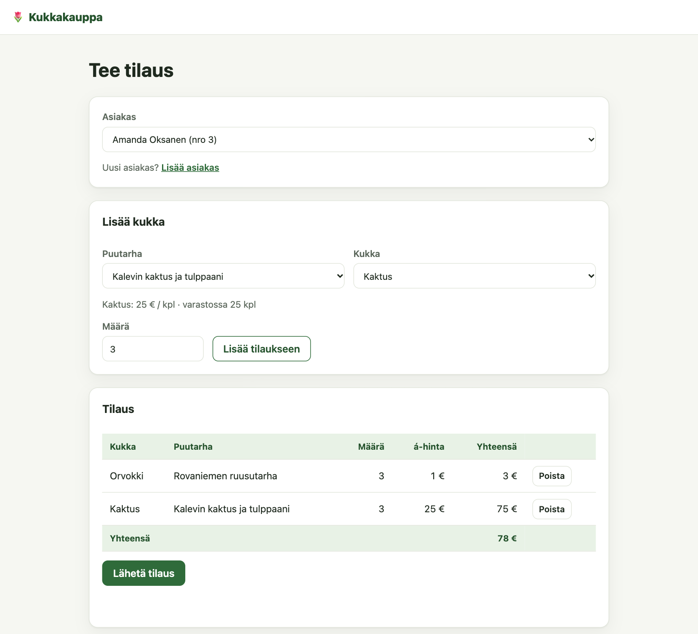
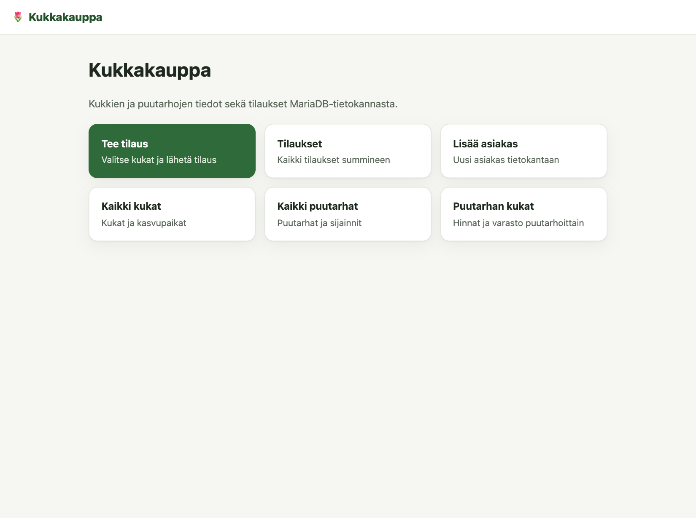
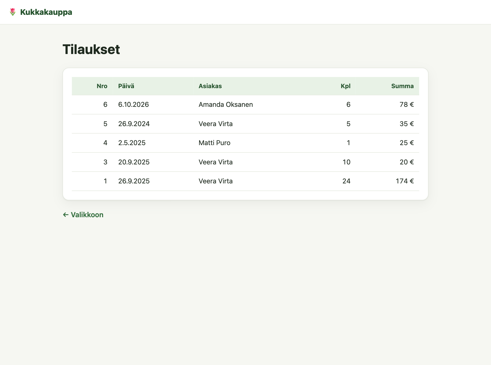
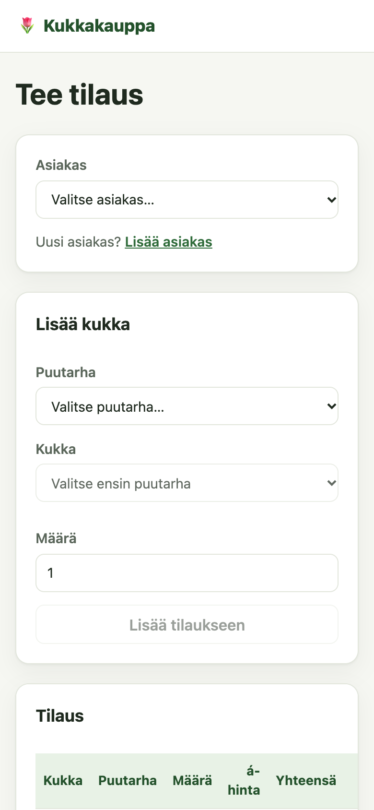
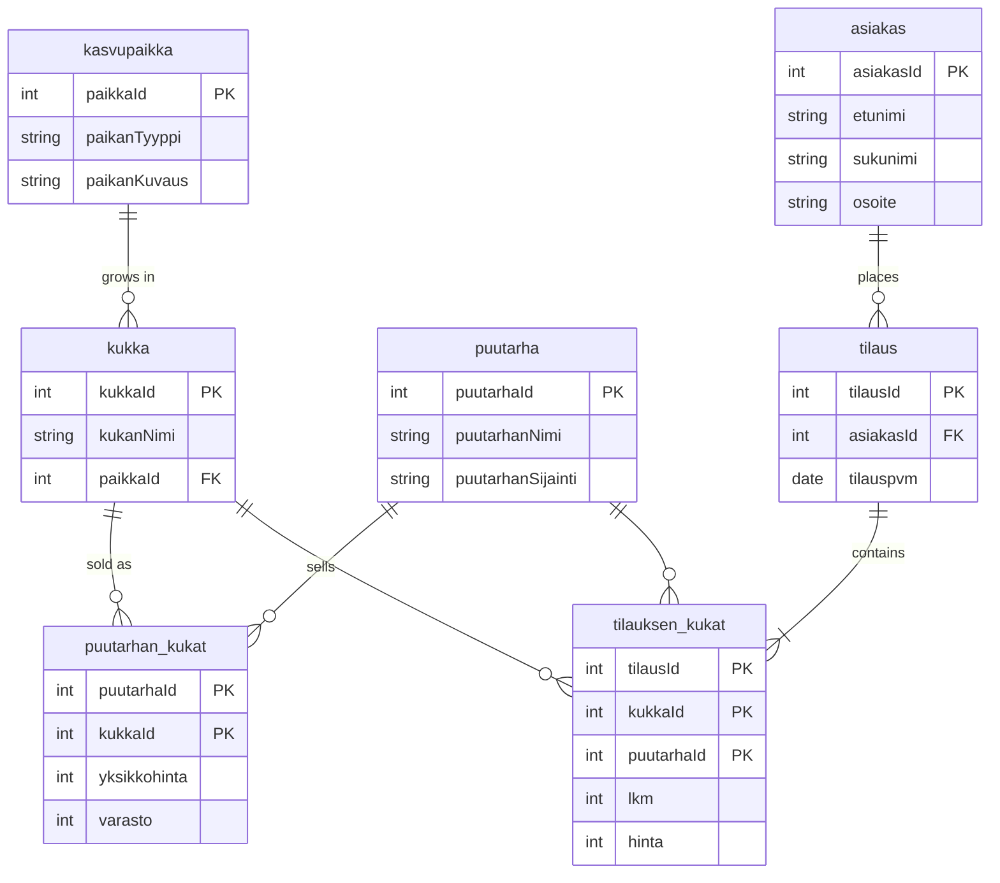

# 🌷 Kukkakauppa — Flower Shop Ordering App

[](https://github.com/BitaYeganeh/flower-shop-sql/actions/workflows/tests.yml)

A flower shop where customers order flowers from different gardens. Built on a **MariaDB** database with an **Express REST API** and a plain JavaScript front end. The interface is in Finnish.



## Features

- Browse all flowers with their growing places, all gardens, and each garden's flowers with **price and stock**
- **Place an order:** choose a customer, add flowers from one or more gardens, see the total, send
- Prices are taken **from the database**, stock is **checked and reduced**, and the whole order is saved in **one transaction**: if any line fails, nothing is saved
- Add customers, with validation and a clear message for a duplicate customer number
- Order list with totals per order
- Works on phones

| Menu | Orders | Phone |
| --- | --- | --- |
|  |  |  |

## Database

Seven tables. Prices and stock belong to a **garden–flower pair** (`puutarhan_kukat`), so the same flower can have a different price in each garden.



SQL files are in [`database/`](database): [`create-database.sql`](database/create-database.sql), [`schema.sql`](database/schema.sql), [`sample-data.sql`](database/sample-data.sql) and [`example-queries.sql`](database/example-queries.sql) (joins, calculated columns, sorting).

## API

All SQL statements are kept in [`sqlasetukset.json`](sqlasetukset.json) and use **parameters** (`?`), never string concatenation, so user input cannot change a query.

| Method | Path | Returns |
| --- | --- | --- |
| GET | `/kukat` | All flowers with growing place |
| GET | `/puutarhat`, `/puutarhalista` | Gardens |
| GET | `/puutarhankukat/:id` | One garden's flowers with price and stock |
| GET | `/kukkalista/:pid` | Flowers a garden sells (for a drop-down) |
| GET | `/tilaustiedot/:pid/:kid` | Price and stock of one flower in one garden (404 if not sold there) |
| GET | `/asiakkaat` | Customers |
| POST | `/uusiasiakas` | Adds a customer (400 missing fields, 409 duplicate number) |
| POST | `/tilaus` | Saves an order `{ asiakasId, tilausrivit: [{ puutarhaId, kukkaId, lkm }] }` (400 with a message for bad input or too little stock) |
| GET | `/tilaukset` | Orders with item count and total |

## Tests

10 API tests with Node's built-in test runner run against a **real MariaDB test database** (rebuilt before every test) and in **GitHub Actions** on every push, with MariaDB as a service container. They cover:

- the read endpoints and a 404 for a flower a garden does not sell
- adding a customer, missing fields (400) and a duplicate number (409)
- an order: the **database price is used** even if the browser sends another, and **stock is reduced**
- **rollback:** an order whose second line asks for too much stock saves **nothing** and uses **no stock**
- an unknown customer and an empty order are rejected

Test file: [`test/api.test.js`](test/api.test.js) · Workflow: [`.github/workflows/tests.yml`](.github/workflows/tests.yml)

## Run it locally

You need Node.js 20.6+ and MariaDB.

```bash
# 1. Create the database, user and tables (as a MariaDB admin user)
mariadb -u root -p < database/create-database.sql
mariadb -u root -p kukkakauppa < database/schema.sql
mariadb -u root -p kukkakauppa < database/sample-data.sql

# 2. Settings and packages
cp .env.example .env
npm install

# 3. Start: http://localhost:3000
npm start
```

Run the tests (uses the `kukkakauppa_test` database created in step 1):

```bash
npm test
```

## Course work and later improvements

The database, SQL queries and first version of the app were built during the **SQL course at Business College Helsinki** (autumn 2025); see the first commit. Afterwards I finished and hardened it:

- **Fixed a transaction bug:** saving an order opened a new database connection for every row, so the rollback could not undo anything. Now the whole order runs in one transaction on one connection
- **Security:** order prices come from the database instead of the browser; the database password moved from a JSON file to `.env` (not in Git)
- **Finished the order page**, which could not send an order, and added the orders page
- Database errors return a 500 with a message instead of an empty list
- Sample data can be re-run (child tables are deleted first)
- Automated tests in CI, a new look, and this README

## Project structure

```
app.js               Express app and API routes
palvelin.js          Starts the server with settings from .env
varastokirjasto.js   Database access and the order transaction
sqlasetukset.json    All SQL statements
database/            SQL scripts
public/              Front end (HTML pages, JavaScript, CSS)
test/                API tests
```

## Author

**Bita Yeganeh** · [GitHub](https://github.com/BitaYeganeh) · [Portfolio](https://myportfolio-u7mw.onrender.com)
